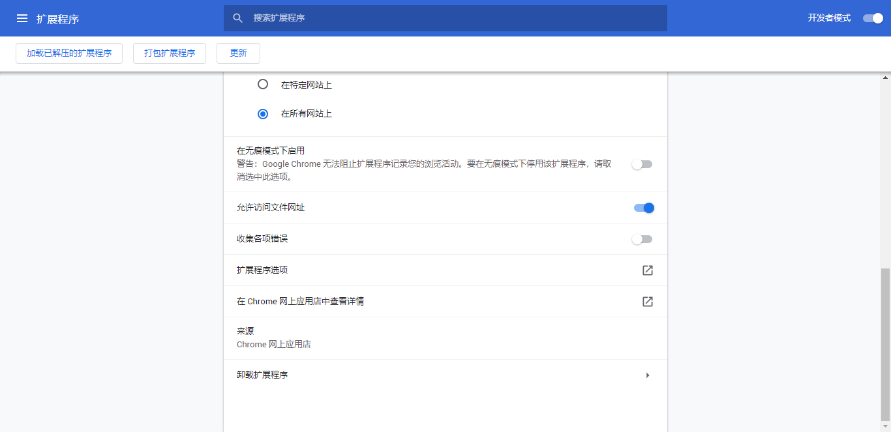

# Nalomu local TXT reader
在本地浏览器阅读TXT小说吧！  
## 安装  
安装油猴插件https://www.tampermonkey.net/  
在release 里选择  
[Nalomu.local.TXT.reader.cdn.user.js](https://github.com/nalomu/local-txt-reader/releases/download/1.0.1/Nalomu.local.TXT.reader.cdn.user.js)
或  
[Nalomu.local.TXT.reader.local.user.js](https://github.com/nalomu/local-txt-reader/releases/download/1.0.1/Nalomu.local.TXT.reader.local.user.js)  
点击安装  
如果你安装了油猴应该会自动弹出安装页面   
### 区别 
.cdn.user.js  有外部引入  
.local.user.js 无外部引入，可离线使用  

## 常见问题
 油猴没有识别到file:///  
需要在扩展程序里允许油猴访问文件网址

